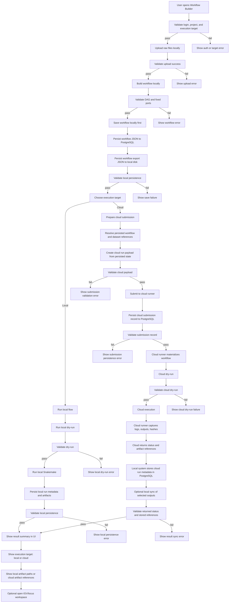

# Future Connected Flow

This flow extends the local-first model from `AGENTS.md`.

Key rules:

- Local persistence happens first
- Cloud execution is optional
- Cloud execution never replaces local storage or PostgreSQL indexing
- Every stage still has validation

## Mermaid

## Step List

1. Validate local session and project
2. Upload raw data locally
3. Validate raw upload
4. Build workflow locally
5. Validate builder graph
6. Save workflow to PostgreSQL
7. Export workflow JSON to local disk
8. Validate local persistence
9. Choose execution target

### Local target

10. Dry-run locally
11. Validate dry-run
12. Execute locally
13. Store local run metadata
14. Store local artifacts
15. Validate local result persistence

### Cloud target

10. Resolve saved workflow and input references
11. Build cloud submission payload
12. Validate payload
13. Submit job
14. Store cloud submission record in PostgreSQL
15. Validate submission record
16. Cloud dry-run
17. Validate cloud dry-run
18. Cloud execution
19. Receive status, logs, and artifact references
20. Store cloud run metadata locally in PostgreSQL
21. Optionally sync selected outputs back to local disk
22. Validate stored cloud results

## Cloud-Specific Requirements

- Workflow and dataset references must come from persisted local records
- Cloud run must be traceable back to:
  - workflow_id
  - run_id
  - project_id
  - local dataset records
- UI must clearly label:
  - local run
  - cloud run
- Cloud result view must still be queryable from PostgreSQL

## UX Requirements

- User must know before pressing `Run` whether it will execute locally or in the cloud
- Result screen must show:
  - execution target
  - persisted run id
  - where artifacts are stored
  - whether files are local, remote, or synced back
