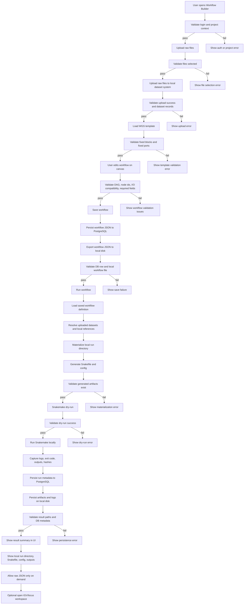

# Local-Only Flow

This flow reflects the local execution direction required by `AGENTS.md`.

Key rules:

- Everything runs locally
- Workflow definitions persist to PostgreSQL
- Workflow/result artifacts persist to local disk
- Every major stage has validation before continuing

## Mermaid

## Step List

1. User opens builder
2. Validate login and project context
3. Upload raw files
4. Validate upload
5. Load fixed WGS template
6. Validate builder state
7. Save workflow
8. Write workflow to PostgreSQL
9. Write workflow export JSON to local disk
10. Validate persistence
11. Run workflow
12. Resolve local inputs
13. Materialize run directory
14. Generate `Snakefile` and config
15. Validate generated files
16. Run `snakemake -n`
17. Validate dry-run
18. Run Snakemake locally
19. Capture outputs/logs/hashes
20. Write run metadata to PostgreSQL
21. Write artifacts to local disk
22. Validate stored results
23. Show readable result summary in UI

## Storage Targets

- PostgreSQL:
  - workflow definition
  - workflow metadata
  - run metadata
  - provenance metadata
  - artifact paths

- Local disk:
  - workflow export JSON
  - generated `Snakefile`
  - generated config
  - logs
  - result files
  - reproducibility metadata

## UI Requirements

- `Save` must tell the user the workflow was written to PostgreSQL and exported locally
- `Run` result must show local run directory and output paths
- Validation failures must stop the flow before execution
